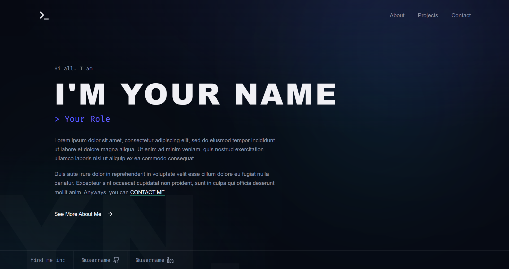
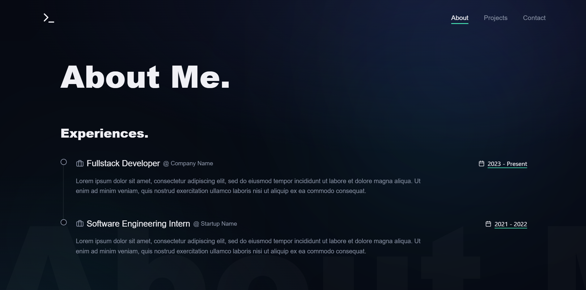
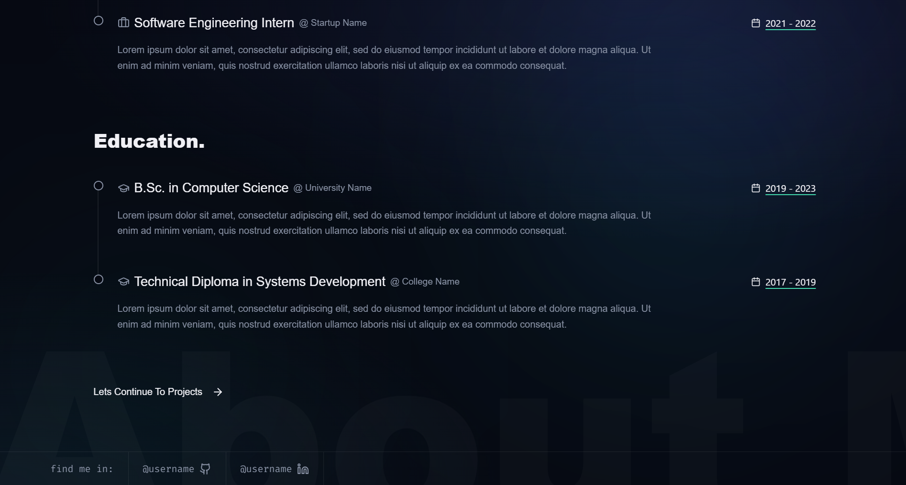
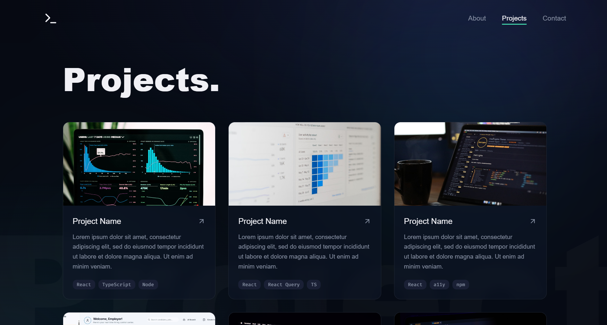
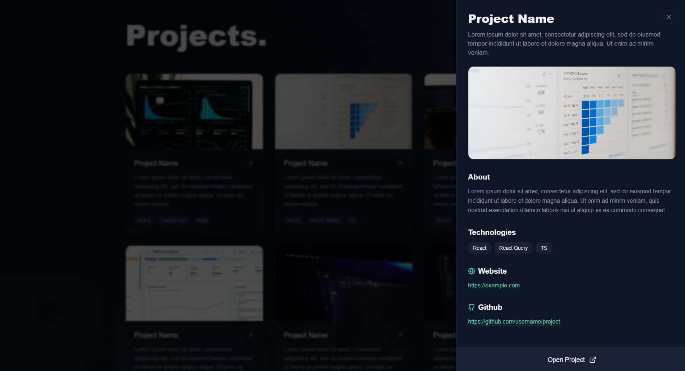
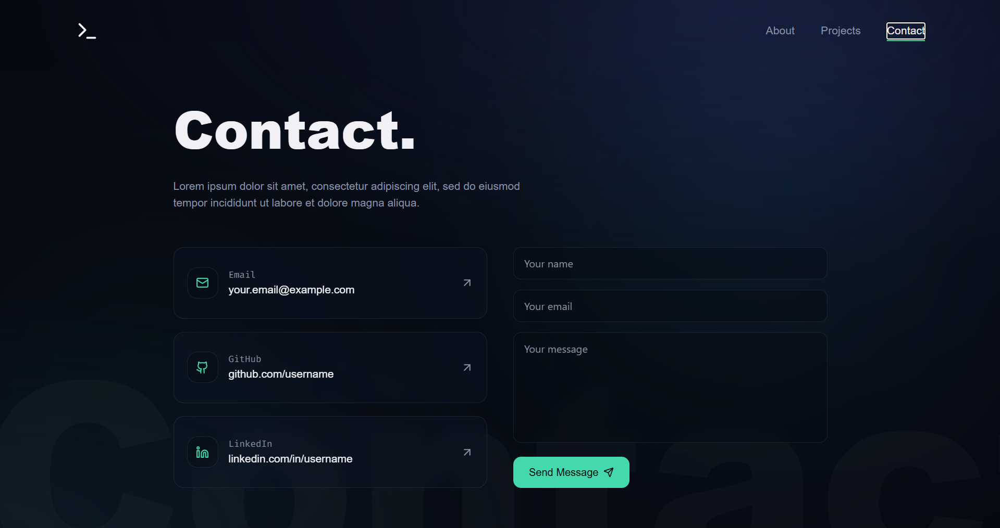

# Portfólio Profissional

Este projeto é um portfólio profissional criado para a disciplina de Laboratório de Desenvolvimento de Software. O objetivo principal é demonstrar habilidades, experiências, formações e projetos de uma maneira visualmente organizada, moderna e profissional.

O portfólio foi pensado como um espaço para apresentar a identidade do autor, com seções voltadas para:

- apresentação pessoal;
- formação acadêmica;
- experiências profissionais;
- projetos realizados;
- contato e redes sociais.

## Integrantes

[Barbara Marcella Inácio da Silva](https://github.com/Barbarainnacio)

[Lucas Gabriel de Oliveira Franco](https://github.com/lucasfrgabriel)

[Maria Clara Neri Stankunas](https://github.com/mariaclaranerii)

[Yago Garzon Chaves](https://github.com/yagogarzon)

## Tecnologias

- React
- TypeScript
- Vite
- @vitejs/plugin-react

Essas ferramentas foram escolhidas para criar uma aplicação moderna, rápida e de fácil manutenção, com foco em uma interface responsiva e experiências de usuário agradáveis.

## Wireframes

A seguir estão os wireframes para o desenvolvimento do portfólio:

### Página inicial

### Experiências

### Educação

### Projetos

### Drawer de projetos

### Página de contato

## Objetivo do projeto

Além de cumprir os requisitos da disciplina, este portfólio tem como finalidade apresentar de forma clara e profissional os dados acadêmicos, competências e trabalhos desenvolvidos, servindo como um cartão de apresentação digital.
